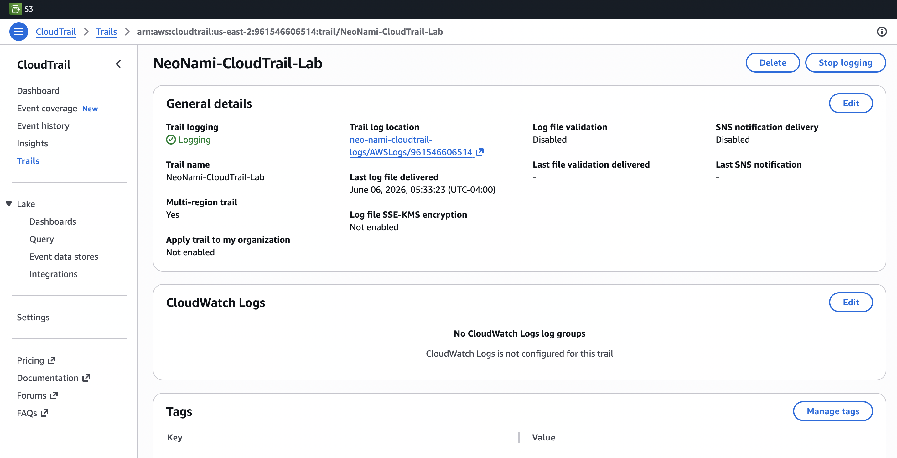
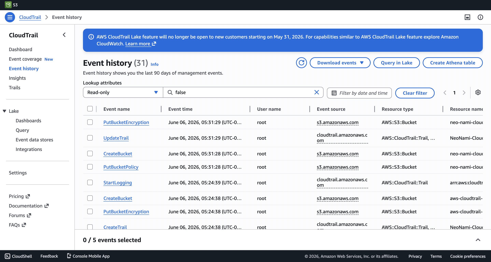

# AWS CloudTrail Monitoring Lab

## Project Objective

Configure AWS CloudTrail to capture and monitor account activity, providing visibility into security events and administrative actions.

## Services Used

- AWS CloudTrail
- Amazon S3

## Concepts Demonstrated

- Security Monitoring
- Event Logging
- Audit Trails
- Activity Tracking
- Compliance Visibility

## Steps Performed

1. Created a CloudTrail trail
2. Configured an S3 bucket for log storage
3. Enabled management event logging
4. Generated account activity
5. Reviewed event history
6. Verified successful log delivery

## Screenshots

### CloudTrail Trail Created

### Event History

## Key Takeaways

CloudTrail provides visibility into actions performed within AWS accounts and is a foundational service for auditing, compliance, and security investigations.
